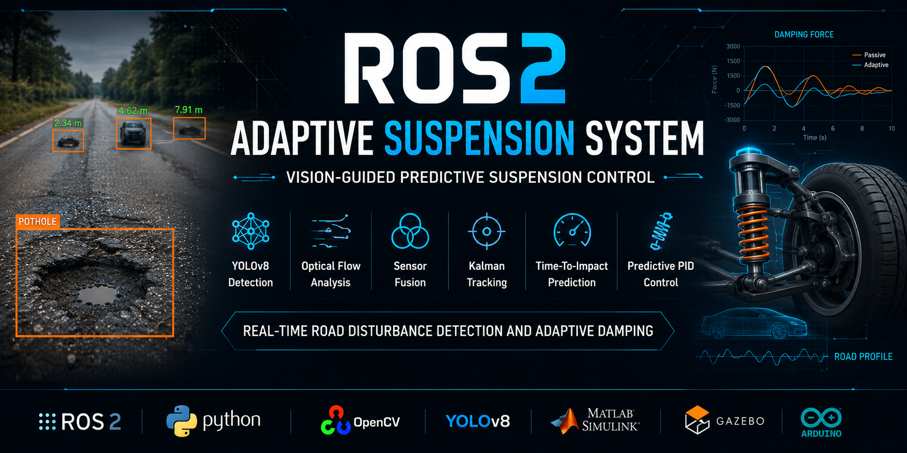
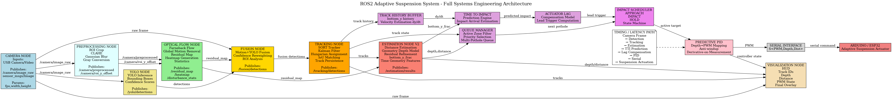
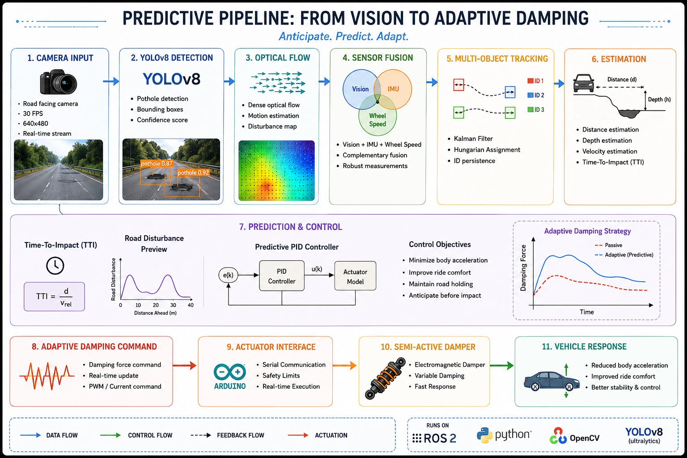
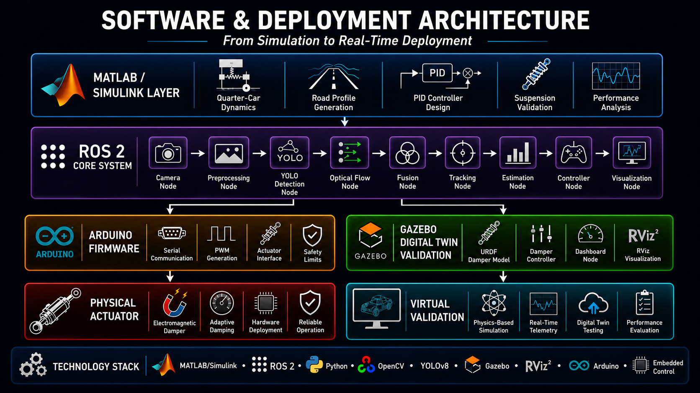
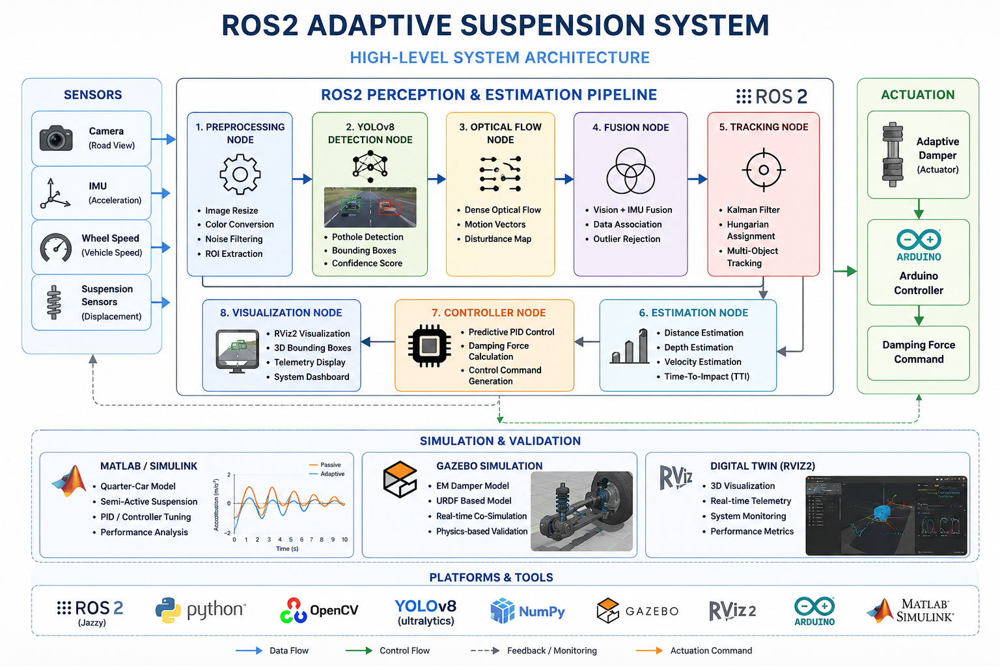

# ROS2 Adaptive Suspension System

## Project Demonstration

## Overview

A real-time adaptive suspension system that combines computer vision, robotics middleware, control systems, and vehicle dynamics to predict road disturbances and adjust suspension damping before impact.

The system uses a YOLO-based pothole detection pipeline, optical-flow motion analysis, sensor fusion, multi-object tracking, depth estimation, and predictive control to generate adaptive damping commands in real time.

The project was developed as a Mechanical Engineering final-year project at the National Institute of Technology (NIT) Srinagar.

---

## Key Features

* Real-time pothole detection using YOLOv8
* Dense optical-flow based disturbance analysis
* Multi-sensor fusion engine
* Kalman Filter + Hungarian Algorithm tracking
* Distance and depth estimation
* Time-to-Impact (TTI) prediction
* Predictive PID control
* ROS2-based modular architecture
* Arduino actuator interface
* Gazebo/RViz digital twin simulation
* MATLAB/Simulink quarter-car validation

---

## Repository Structure
ROS2-Adaptive-Suspension-System
│
├── docs
│   ├── architecture
│   ├── images
│   └── report
│
├── firmware
│   └── MicroController
│
├── models
│   └── best.pt
│
├── ros2_packages
│   ├── semi_active_suspension_system
│   └── gazebo_simulation_suspension_system
│
├── simulink
│   └── AdaptiveSuspensionpid(1).slx
│
└── videos

## Running the System
Build
cd ~/ros2_ws

colcon build

source install/setup.bash
Launch
ros2 launch semi_active_suspension_system system.launch.py
Gazebo Digital Twin
ros2 launch gazebo_simulation_suspension_system damper_simulation_launch.py

## System Architecture

Camera
→ Preprocessing
→ YOLO Detection
→ Optical Flow
→ Sensor Fusion
→ Tracking
→ Estimation
→ Predictive Controller
→ Suspension Actuator

---

## Technologies Used

* ROS2 Jazzy
* Python
* OpenCV
* Ultralytics YOLOv8
* NumPy
* Arduino
* MATLAB/Simulink
* Gazebo
* RViz2

---

## Simulation Components

### Simulink

* Quarter-car model
* Semi-active damper
* PID controller
* Multiple road profiles

### ROS2

* Camera node
* Preprocessing node
* YOLO detection node
* Optical flow node
* Fusion node
* Tracking node
* Estimation node
* Controller node
* Visualization node

### Digital Twin

* Electromagnetic damper model
* RViz visualization
* URDF-based simulation
* Live telemetry dashboard

---

## Results

The system demonstrates predictive road disturbance detection and adaptive damping control through simulation and virtual validation.

Key capabilities include:

* Real-time pothole detection
* Multi-object tracking
* Impact prediction
* Adaptive damping scheduling
* Digital twin verification

---

## Future Work

* Stereo vision integration
* LiDAR fusion
* Model Predictive Control (MPC)
* Reinforcement learning based suspension control
* Full-scale vehicle deployment

---

## Author

Azlan Ahmad Shah
Mohammad Ibrahim Malik
Muzammil Ahmed Wani
Basit Bashir

Department of Mechanical Engineering

National Institute of Technology Srinagar

## License

MIT License